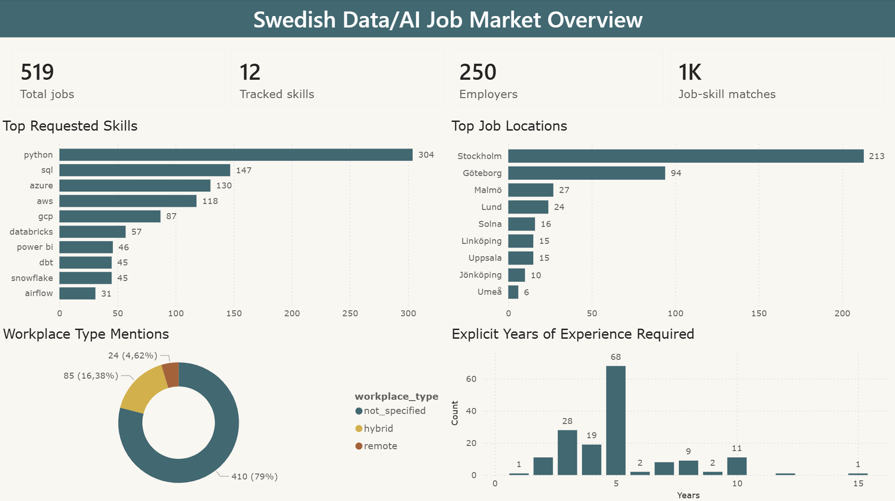
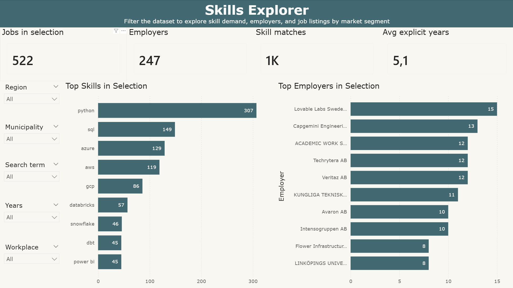
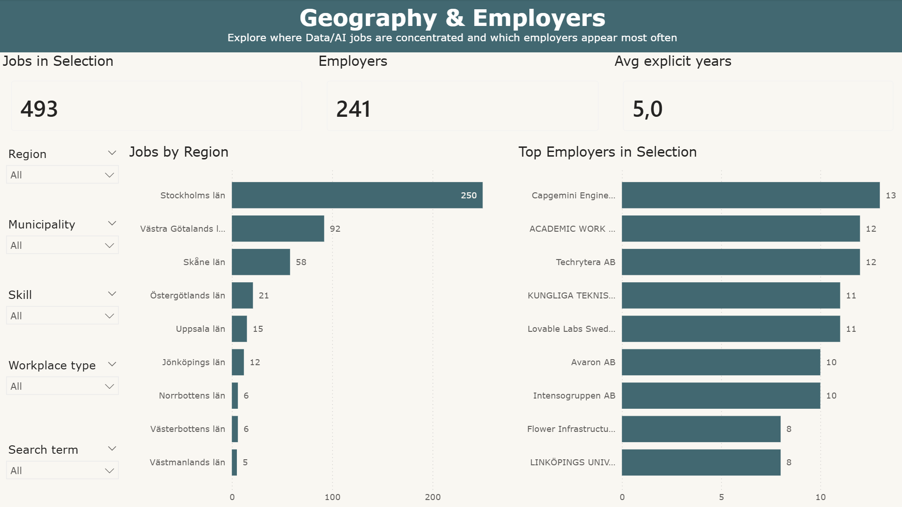

# Swedish Job Market Analytics

A data engineering and analytics portfolio project analyzing Swedish Data/AI job postings from Arbetsförmedlingen's open JobTech API.

The project collects job listings, processes them with PySpark, creates analytics-ready datasets, uploads outputs to Azure Blob Storage, and visualizes the results in Power BI.

## Project Goal

The goal of this project is to build an end-to-end data pipeline for analyzing the Swedish Data/AI job market.

The analysis focuses on questions such as:

* Which skills are most commonly mentioned in Data/AI job postings?
* Where in Sweden are Data/AI jobs concentrated?
* Which employers appear most often in the dataset?
* How often are remote or hybrid work options mentioned?
* What explicit years-of-experience requirements are mentioned in job descriptions?

## Current Status

The project currently includes:

* Data extraction from the JobTech API
* Raw CSV storage
* PySpark-based transformation pipeline
* Skill extraction using regex and keyword rules
* Workplace type classification
* Explicit years-of-experience extraction
* Data quality checks
* Processed Parquet datasets
* Clean CSV exports for dashboard consumption
* Azure Blob Storage upload stage
* One-command Docker Compose pipeline
* Power BI report with three dashboard pages

## Tech Stack

* Python
* PySpark
* Pandas
* Docker
* Docker Compose
* Azure Blob Storage
* Power BI
* Git / GitHub

## Project Structure

```text
swedish-job-market-analytics/
├── src/
│   ├── extract.py
│   ├── transform.py
│   ├── quality_checks.py
│   ├── upload_to_blob.py
│   └── config.py
├── data/
│   ├── raw/
│   ├── processed/
│   └── exports/
├── docs/
│   ├── ReportPage.png
│   ├── ReportPage2.png
│   └── ReportPage3.png
├── reports/
│   └── swedish_job_market_dashboard.pbix
├── Dockerfile
├── docker-compose.yml
├── requirements.txt
├── .env.example
├── .gitignore
└── README.md
```

The `data/` directory is generated locally and is not intended to be committed to Git.

## Pipeline Overview

```text
JobTech API
    ↓
Raw CSV
    ↓
PySpark Transform
    ↓
Processed Parquet Datasets
    ↓
CSV Dashboard Exports
    ↓
Azure Blob Storage
    ↓
Power BI Report
```

The full ETL-pipeline can be run with:

```bash
docker compose run --rm pipeline
```

This runs:

```text
extract → transform → quality checks → upload
```

The upload step overwrites existing Azure blobs with the latest generated outputs.

## How to Run

### 1. Clone the repository

```bash
git clone <https://github.com/Denillox/swedish-job-market-analytics/tree/main>
cd swedish-job-market-analytics
```

### 2. Create a `.env` file

Create a local `.env` file based on `.env.example`:

```env
AZURE_STORAGE_CONNECTION_STRING=your_connection_string_here
AZURE_CONTAINER_NAME=job-market-data
```

### 3. Build and run the full pipeline

```bash
docker compose run --rm pipeline
```

### 4. Run individual pipeline stages

```bash
docker compose run --rm extract
docker compose run --rm transform
docker compose run --rm quality
docker compose run --rm upload
```

## Data Outputs

### Raw Data

| Output                  | Description                                     |
| ----------------------- | ----------------------------------------------- |
| `data/raw/raw_jobs.csv` | Raw job postings collected from the JobTech API |

### Processed Parquet Datasets

| Dataset                           | Description                                                  |
| --------------------------------- | ------------------------------------------------------------ |
| `jobs.parquet`                    | One row per job posting                                      |
| `job_skills.parquet`              | One row per job-skill match                                  |
| `skill_counts.parquet`            | Aggregated count by detected skill                           |
| `location_counts.parquet`         | Aggregated count by region and municipality                  |
| `workplace_type_counts.parquet`   | Aggregated count by workplace type                           |
| `employer_counts.parquet`         | Aggregated count by employer                                 |
| `experience_counts.parquet`       | Aggregated count by API experience flag                      |
| `years_experience_counts.parquet` | Aggregated count by explicit years-of-experience requirement |

### CSV Dashboard Exports

The transform step also creates clean CSV files for Power BI:

| Export                        | Description                          |
| ----------------------------- | ------------------------------------ |
| `jobs.csv`                    | Job-level dashboard dataset          |
| `job_skills.csv`              | Job-skill relationship dataset       |
| `skill_counts.csv`            | Skill count summary                  |
| `location_counts.csv`         | Location count summary               |
| `workplace_type_counts.csv`   | Workplace type summary               |
| `employer_counts.csv`         | Employer count summary               |
| `experience_counts.csv`       | API experience flag summary          |
| `years_experience_counts.csv` | Explicit years-of-experience summary |
| `pipeline_summary.csv`        | High-level pipeline metrics          |

## Azure Blob Storage Layout

The upload stage writes the latest outputs to Azure Blob Storage using this structure:

```text
raw/
├── raw_jobs.csv

processed/
├── jobs.parquet/
├── job_skills.parquet/
├── skill_counts.parquet/
├── location_counts.parquet/
├── workplace_type_counts.parquet/
├── employer_counts.parquet/
├── experience_counts.parquet/
└── years_experience_counts.parquet/

exports/
├── jobs.csv
├── job_skills.csv
├── skill_counts.csv
├── location_counts.csv
├── workplace_type_counts.csv
├── employer_counts.csv
├── experience_counts.csv
├── years_experience_counts.csv
└── pipeline_summary.csv
```

## Power BI Report

The Power BI report contains three pages:

1. **Overview**
   High-level summary of total jobs, tracked skills, employers, job-skill matches, workplace type mentions, top requested skills, top job locations, and explicit years-of-experience requirements.

2. **Skills Explorer**
   Interactive page for filtering the dataset by region, municipality, search term, workplace type, and experience years to explore skill demand and employers by market segment.

3. **Geography & Employers**
   Geographic breakdown showing where Data/AI jobs are concentrated and which employers appear most often in selected market segments.

## Dashboard Preview

### Overview



### Skills Explorer



### Geography & Employers



## Data Processing Notes

Skill detection is based on predefined keyword and regex patterns. The current tracked skills include examples such as:

* Python
* SQL
* PySpark
* Spark
* Databricks
* Airflow
* Azure
* AWS
* GCP
* Snowflake
* dbt
* Power BI

Workplace type classification is also keyword-based. For example, descriptions containing words such as `remote`, `distans`, or `hybrid` are classified accordingly.

The `not_specified` workplace category means that no remote or hybrid keyword was detected. It does not necessarily mean the role is fully on-site.

Explicit years-of-experience requirements are extracted from job descriptions using regex patterns. Blank values mean that no explicit year requirement was detected.

## Data Quality Checks

The project includes a quality check script that validates and previews processed datasets.

Run it with:

```bash
docker compose run --rm quality
```

The quality checks include:

* Total job count
* Missing location checks
* Top skill counts
* Top location counts
* Workplace type distribution
* Employer counts
* Experience requirement counts
* Explicit years-of-experience distribution
* Sample checks for high experience requirements

## Key Limitations

This project uses keyword and regex-based extraction. The results should be interpreted as detected mentions, not perfect classifications.

Important limitations:

* Job descriptions may mention skills in different ways that are not yet captured.
* Workplace type classification depends on keywords in the description.
* `not_specified` does not mean on-site.
* Blank years-of-experience values do not mean no experience is required.
* The dataset depends on selected search terms and available JobTech API results.
* Employer counts may be affected by consultancies, duplicate-like postings, and broad search terms.

## Planned Improvements

Possible future improvements:

* Add scheduled pipeline runs
* Add historical snapshots by collection date
* Improve skill extraction rules
* Add more formal unit tests
* Connect Power BI directly to Azure Blob Storage
* Add more dashboard pages for job listings and trends
* Add an architecture diagram
* Add CI checks for code quality